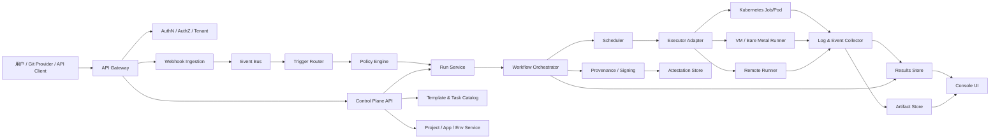

# Tekton CI/CD 架构分析与重实现方案

## 目标

分析 Tekton 的核心架构，并给出一套重新实现完整 CI/CD 平台时更合理的架构蓝图。

本方案面向一个企业内 CI/CD 平台，而不是单纯复制 Tekton CRD。建议保留 Tekton 的好边界：声明式工作流、控制面/执行面分离、事件驱动、可插拔任务、运行历史外置、安全供应链独立组件；但不要完全绑定 Kubernetes CRD 作为唯一产品 API。

## Tekton 的真实模型

Tekton 是 Kubernetes 原生的 CI/CD building blocks，不是一个完整的一体化 DevOps SaaS。它把 CI/CD 拆成一组 Kubernetes Custom Resources 和 controller。

核心对象：

- `Step`: 一个容器化操作，例如 test、build、scan、deploy。
- `Task`: Step 的有序集合，通常对应一个 Kubernetes Pod。
- `Pipeline`: Task 的 DAG 编排，支持 fan-in/fan-out、重试、条件执行。
- `TaskRun`: Task 的一次执行实例。
- `PipelineRun`: Pipeline 的一次执行实例。

外围能力：

- `Triggers`: 事件入口，把 Git webhook、PR、push 等事件解析成 `TaskRun` 或 `PipelineRun`。
- `Results`: 长期运行历史和日志存储，避免把历史压在 Kubernetes etcd / CRD controller 上。
- `Chains`: 供应链安全，基于运行结果生成 provenance、签名并上传。
- `Dashboard`: UI，查看运行状态、日志、YAML、命名空间资源。
- `Remote Resolution`: 从 Git、OCI bundle 等远程源解析可复用 Task/Pipeline。
- `Operator`: 安装、升级和组件生命周期管理。

Tekton 的关键设计不是某个 YAML 格式，而是这几条边界：

1. 定义和运行分离：`Pipeline/Task` 是模板，`PipelineRun/TaskRun` 是实例。
2. 控制和执行分离：controller 负责编排，实际执行交给 Kubernetes Pod。
3. 事件和执行分离：Triggers 只负责把外部事件确定性转成 Run。
4. 当前运行和历史存储分离：Results 把长期历史从 CRD controller 中剥离。
5. 供应链安全旁路化：Chains 观察完成的 Run，不侵入主调度路径。

## 重做完整 CI/CD 时的架构原则

### 不建议照抄的地方

- 不要把 Kubernetes CRD 直接当成唯一产品模型。企业用户需要项目、应用、环境、权限、审批、审计、模板市场，这些不是 Kubernetes 原生对象能自然表达的。
- 不要把 UI 直接操作底层 Run 对象。UI 应该调用平台 API，由平台 API 负责权限、审计、幂等和租户隔离。
- 不要让 webhook 入口直接创建执行任务。事件必须先经过验签、去重、规则匹配、策略检查和审计。
- 不要把日志、artifact、运行历史塞进工作流 controller 的数据库或 Kubernetes CRD。
- 不要让每个 Step 都自由拿所有凭据。凭据要按 pipeline、environment、task scope 下发。

### 建议保留的地方

- 声明式 workflow spec。
- `Definition` 与 `Run` 两层模型。
- DAG 编排，而不是线性 stage-only。
- 每个任务容器化执行，隔离环境。
- 事件入口、执行内核、结果存储、安全证明独立部署。
- 可插拔 resolver，用于任务模板、流水线模板、共享组件版本化。

## 推荐总体架构



## 模块拆解

### 1. Product Control Plane

负责用户可理解的产品模型：

- Organization / Tenant
- Project
- Application
- Environment: dev、test、staging、prod
- Repository binding
- Pipeline template
- Pipeline definition
- Secret / credential reference
- Approval gate
- Deployment target
- Audit event

这里是平台 API 的主入口。它不直接跑任务，只创建规范化后的 `PipelineRun` 请求。

### 2. Workflow Domain Model

建议内部保留 Tekton 风格的两层模型：

- `PipelineDefinition`: 可版本化定义。
- `TaskDefinition`: 可复用任务定义。
- `PipelineRun`: 一次运行实例。
- `TaskRun`: 一个任务实例。
- `StepRun`: 一个容器/命令级执行实例。

需要额外补齐企业级字段：

- `tenantId`
- `projectId`
- `applicationId`
- `environmentId`
- `triggerType`
- `sourceRevision`
- `actor`
- `policySnapshot`
- `secretScope`
- `approvalState`
- `costLabels`

### 3. Workflow Orchestrator

这是系统心脏。职责：

- 解析 workflow spec。
- 构建 DAG。
- 做参数替换、结果传递、条件判断。
- 处理 task retry、timeout、cancel、resume。
- 驱动 task 状态机。
- 生成不可变运行快照。

不要把 executor 逻辑写进 orchestrator。orchestrator 只发出“需要执行一个 TaskRun”的意图。

### 4. Scheduler

职责：

- 根据租户、项目、队列、资源配额调度 TaskRun。
- 控制并发。
- 做优先级和公平性。
- 根据任务类型选择 runner pool。
- 控制环境锁，例如同一 prod 环境只允许一个 deploy。

推荐显式建模：

- `Queue`
- `RunnerPool`
- `ResourceQuota`
- `ConcurrencyGroup`
- `EnvironmentLock`

### 5. Executor Adapter

执行适配层，支持多后端：

- Kubernetes Pod / Job
- 自托管 runner
- VM runner
- Windows runner
- Docker-in-Docker / rootless buildkit
- SSH remote command

Executor 必须是可插拔接口：

```ts
interface ExecutorAdapter {
  prepare(taskRun: TaskRunSpec): Promise<PreparedExecution>;
  start(execution: PreparedExecution): Promise<ExecutionHandle>;
  observe(handle: ExecutionHandle): AsyncIterable<ExecutionEvent>;
  cancel(handle: ExecutionHandle): Promise<void>;
  cleanup(handle: ExecutionHandle): Promise<void>;
}
```

### 6. Event / Trigger Layer

对标 Tekton Triggers，但要企业化：

- webhook endpoint management
- signature verification
- replay protection
- event deduplication
- trigger rules
- payload extraction
- branch / tag / PR filter
- path filter
- manual trigger
- scheduled trigger
- API trigger

事件入口只生成 `TriggerEvent`，由 Trigger Router 再创建 `PipelineRunIntent`。这样便于审计、重放和排查。

### 7. Results / Logs / Artifact

对标 Tekton Results，但建议三类存储分开：

- Metadata DB: PostgreSQL，存 run/task/step 状态、索引、查询字段。
- Log Store: 对象存储或 ClickHouse/Loki，支持流式读取和长期归档。
- Artifact Store: S3/MinIO/OCI registry，存构建产物、测试报告、SBOM。

不要依赖执行集群里的 Pod 日志作为唯一来源。任务完成后，底层执行资源应该可以被清理。

### 8. Policy / Approval / Security

企业 CI/CD 的“完整功能”核心在这里：

- RBAC / ABAC
- branch protection
- environment protection
- manual approval
- change window
- secret scope
- image provenance policy
- deployment policy
- OPA/Rego 或 Cedar 策略扩展

建议在运行前生成 `policySnapshot`，保证审计时能知道当时按哪套策略放行。

### 9. Supply Chain Security

对标 Tekton Chains，做成旁路观察组件：

- run snapshot capture
- artifact digest capture
- SBOM collection
- SLSA provenance generation
- signing: cosign/KMS/keyless
- attestation upload
- verification gate

不要阻塞主执行链路太深。签名失败可以按策略决定 fail run 或标记风险。

### 10. UI Console

核心页面：

- 项目/应用列表
- pipeline 列表和版本
- pipeline graph editor
- run 列表
- run detail DAG
- task/step logs
- artifact/test report
- environment deployment history
- approval inbox
- secrets / integrations
- audit log

UI 不应直接编辑底层执行对象。所有动作走平台 API。

## 推荐技术选型

后端：

- API: Go 或 TypeScript/NestJS。若偏 Kubernetes controller，Go 更合适。
- Orchestrator: Go 更稳，状态机和 watcher 生态成熟。
- DB: PostgreSQL。
- Queue/Event: NATS JetStream / Kafka / RabbitMQ，按团队运维能力选。
- Logs: Loki / ClickHouse / OpenSearch / S3 append chunks。
- Artifact: S3/MinIO + OCI Registry。
- Policy: OPA/Rego 或 Cedar。
- Runner: Kubernetes 优先，预留 VM/Windows runner adapter。

前端：

- React / Next.js
- DAG 可视化用 React Flow
- 日志虚拟列表
- YAML editor 用 Monaco

## MVP 路线

### Phase 1: 最小执行闭环

- Project / Repository / PipelineDefinition
- Manual trigger
- PipelineRun / TaskRun / StepRun 状态机
- Kubernetes executor
- 实时日志
- 基础 UI: run list + run detail + logs

### Phase 2: Git 触发和模板

- Webhook ingestion
- GitHub/GitLab/Gitea adapter
- trigger rules
- task catalog
- template versioning
- artifact upload

### Phase 3: CD 能力

- Environment model
- deployment target
- approval gate
- concurrency lock
- rollback record
- deployment history

### Phase 4: 企业治理

- RBAC / tenant isolation
- audit log
- secret scope
- policy engine
- runner pool quota

### Phase 5: 供应链安全

- SBOM
- provenance
- signing
- attestation
- verification policy

## 最重要的架构决策

1. 产品 API 不等于执行 API。用户面对项目、应用、环境；执行层面对 PipelineRun、TaskRun、StepRun。
2. Run 必须不可变。开始执行后，保存 definition snapshot、参数 snapshot、policy snapshot、resolver snapshot。
3. Orchestrator 不直接依赖 Kubernetes。Kubernetes 是一个 executor adapter。
4. 事件入口不直接创建任务。先验签、去重、审计，再转 PipelineRunIntent。
5. 日志和历史必须外置。执行资源可清理，运行历史仍可查询。
6. 密钥按最小 scope 注入。不要把项目级凭据默认给所有 step。
7. 供应链安全做旁路 watcher。它观察 run 完成事件，生成证明和签名。

## 最大风险

- 状态机复杂度被低估：cancel、retry、timeout、finally、partial failure、manual approval 都会让 DAG 状态机变复杂。
- 日志系统被低估：实时流、断线续读、归档读取、权限过滤都不是简单 stdout。
- Secret 泄露风险：日志脱敏、环境变量泄露、artifact 泄露都要从第一版设计。
- Runner 隔离不足：多租户执行时，Kubernetes namespace 不是完整安全边界。
- YAML 过早暴露给用户：如果没有上层产品模型，后期会变成难维护的内部 DSL 平台。

## 推荐结论

如果要重新实现完整 CI/CD，不建议“复制 Tekton”。更好的架构是：

- 借鉴 Tekton 的执行模型：`Task/TaskRun/Pipeline/PipelineRun`。
- 借鉴 Tekton 的组件边界：Pipelines、Triggers、Results、Chains、Dashboard。
- 在其上加一层企业产品控制面：Project、Application、Environment、Approval、Policy、Audit、RunnerPool。
- 执行层从第一天就抽象成多 executor adapter，Kubernetes 只是默认实现。
- 历史、日志、artifact、安全证明独立存储和独立生命周期。

最终平台形态应该是“企业 CI/CD 控制面 + 可插拔执行内核”，而不是“Kubernetes CRD UI”。

## 参考来源

- Tekton docs: https://tekton.dev/docs/
- Tekton Pipelines: https://tekton.dev/docs/pipelines/
- Tekton concept model: https://tekton.dev/docs/concepts/concept-model/
- Tekton Triggers: https://tekton.dev/docs/triggers/
- Tekton Results: https://tekton.dev/docs/results/
- Tekton Chains SLSA provenance: https://tekton.dev/docs/chains/slsa-provenance/
- Tekton Dashboard: https://tekton.dev/docs/dashboard/
- Tekton Remote Resolution: https://tekton.dev/docs/pipelines/resolution/
- Tekton Operator install profiles: https://tekton.dev/docs/operator/install/
