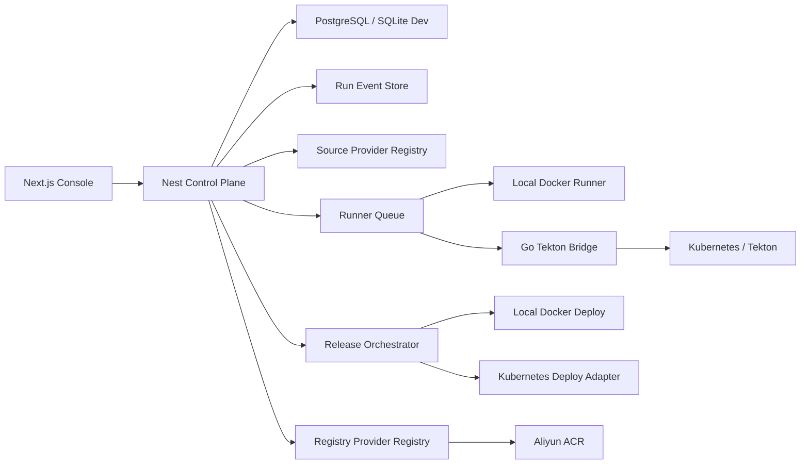

# Deploy Management Architecture Audit

## 目标

当前项目已经完成了从“演示型流水线”到“本地真实拉取、真实打包、Docker build、ACR push、制品中心、上线入口”的第一轮演进。本轮检查的重点不是继续补一个按钮，而是确认这套架构是否能稳定支撑后续服务器部署、真实 Tekton、真实制品管理和真实上线。

结论：当前方向是对的，模块边界也已经从单体演示开始拆开；但仍存在 6 类核心缺陷。如果不处理，后续一旦迁移到服务器或多人使用，会出现运行记录丢失、镜像 tag 冲突、真实 Tekton 与 UI 展示不一致、上线目标不可追溯、执行器卡死不可恢复等问题。

## 当前架构快照

```text
apps/web
  Next.js 控制台，展示流水线、配置、运行详情、制品中心、Tekton 控制面。

apps/api
  NestJS 控制面，管理 pipeline、run、artifact、release、repository、environment、snapshot。

packages/shared
  前后端共享领域模型，同时包含平台模型、云效 OpenAPI 对齐模型、Tekton 模型。

services/tekton-bridge
  Go 服务，对 Nest 暴露 create/get/cancel/events/health，内部可用 simulated 或 tekton backend。

local-docker executor
  Nest 内部执行器，本地执行 git clone、package build、docker build、docker login、docker push。
```

已有能力：

- 代码仓库 refs：`apps/api/src/code-repos/code-repos.service.ts` 已支持 GitHub / GitLab / GitCode 的分支、Tag、最近提交拉取。
- 真实执行器：`apps/api/src/executors/executors.module.ts` 通过 `EXECUTOR=simulated|tekton|local-docker` 选择执行器。
- 本地真实构建：`apps/api/src/executors/local-docker.executor.ts` 已执行真实 `git`、包管理器、Docker build / push。
- Tekton bridge：`services/tekton-bridge/internal/backend/tekton.go` 已能创建真实 `PipelineRun`，并观察 `TaskRun` 状态和 result。
- 制品上线入口：`apps/api/src/releases/releases.service.ts` 已支持 image artifact 上线到 `local-docker` 或 `kubernetes`。

## 核心缺陷

### P0-1. 控制面仍然是内存态，不能作为真实 CI/CD 平台

证据：

- `apps/api/src/common/in-memory.repository.ts` 明确是内存版 Repository。
- `apps/api/src/runs/runs.service.ts` 用 `private sequence = 1`、`liveTimers`、`runHandles` 维护运行态。
- `apps/api/src/pipelines/pipelines.service.ts` 用 `pipe-custom-${this.sequence++}` 生成流水线 ID。
- `apps/api/src/runs/runs.service.ts` 用 `runNumber: this.sequence++` 生成运行编号。

影响：

- API 重启后 run、artifact、release、approval、audit 全部丢失。
- run id / pipeline id 会从 1 重新开始，容易复用旧 tag，导致用户复制出来的镜像 tag 与 registry 里的真实结果不一致。
- 正在运行的 local-docker / Tekton PipelineRun 无法恢复状态。
- 多实例部署时每个 API 进程看到的数据不一致。

必须改成：

- 引入持久化层：本地开发可 SQLite，服务器使用 PostgreSQL。
- 所有 ID 使用 ULID / UUID，不再使用进程内 sequence。
- 所有运行态通过数据库中的 `Run`、`StageRun`、`TaskRunEvent`、`Artifact`、`Release`、`AuditEvent` 恢复。
- API 启动时执行 reconciliation：扫描 running/queued run，重新绑定 executor handle 或从 Tekton / Docker 状态恢复。

### P0-2. 真实执行流程与模拟流程还没有彻底隔离

证据：

- `apps/api/src/lifecycle/lifecycle.engine.ts` 仍有 `simulateUntilGate`。
- `apps/api/src/runs/runs.service.ts` 仍接受 `options.mode === "instant"`。
- `apps/api/src/lifecycle/lifecycle.engine.ts` 在没有 `commitSha` 时用 `createCommit()` 生成随机 commit。

影响：

- 用户已经明确要求“正式拉取代码、正式打包、正式上传”，模拟分支继续存在会让流程边界不干净。
- 随机 commit 会进入镜像 tag、provenance、UI 运行记录，和真实 checkout 的 commit 不一定一致。
- 后续审计、回滚、SLSA / Chains 证据链会被污染。

必须改成：

- 将 demo/simulated mode 从真实 pipeline trigger 中拆出去，作为独立 demo route 或 seed demo。
- 真实 run 创建前必须解析 commit：
  - branch: 调用 provider API 或 `git ls-remote` 获取 HEAD sha。
  - tag: 解析 tag 对应 commit sha。
  - fixed commit: 校验 commit 存在。
- `Run.resolvedCommit` 成为镜像 tag、provenance、artifact lineage 的唯一来源。

### P0-3. 执行器缺少队列、并发限制、超时和恢复

证据：

- `apps/api/src/runs/runs.service.ts` 用 `setTimeout(..., 700)` 轮询 executor status。
- `apps/api/src/executors/local-docker.executor.ts` 每次 run 直接 spawn `git`、包管理器和 `docker`。
- `services/tekton-bridge/internal/backend/tekton.go` 的 `Events` 使用 2 秒轮询 `Status`，不是 informer/watch。

影响：

- 多个用户同时运行时，本地 Docker 构建会互相抢资源。
- 任意一个 `npm install`、`docker build`、`docker push` 卡住，控制面缺少统一超时与取消策略。
- API 重启后没有 runner ownership，无法判断某个任务是否还在执行。
- 前端实时性依赖 `/api/snapshot` 秒级轮询，成本高，也不是每一步的真实事件流。

必须改成：

- 新增 `RunnerQueue`：
  - runner profile：`local-docker`、`tekton`、后续 `remote-buildkit`。
  - concurrency：按 profile / environment / repository 限制并发。
  - lease：数据库记录 runner ownership 和 heartbeat。
  - timeout：stage-level 和 command-level 超时。
  - retry：明确可重试类型，例如网络 push timeout。
- 新增事件总线：
  - `RunEvent` 先写 DB / append-only event store。
  - Web 通过 SSE / WebSocket 订阅 run event。
  - Snapshot 只做聚合，不承担实时日志职责。

### P0-4. Tekton 展示仍有合成数据，真实控制面与 UI 没有完全对齐

证据：

- `apps/api/src/snapshot/snapshot.service.ts` 通过环境变量和平台 run 数据合成 Tekton snapshot。
- `apps/web/app/lib/snapshot-context.tsx` 在 API 没有 tekton 字段时会 `createFallbackTekton`。
- `apps/api/src/snapshot/snapshot.service.ts` 的 `imageDigestResult` 只接受 `run.executor?.backend === "tekton"`，会忽略 `local-docker` 推送出来的真实 digest。

影响：

- 用户看到“Tekton 控制面 Ready / PipelineRun / TaskRun”时，不能确定这是集群真实对象还是 UI 合成对象。
- local-docker 真实镜像可能在某些视图里被当成 waiting / unsigned / 非真实结果。
- 每一步点击查看详情时，缺少真实 Pod、Step、Log、Result、Workspace、Resolver 来源。

必须改成：

- `TektonObservedState` 只能来自 Go bridge 或 Kubernetes API，不再由前端 fallback 合成。
- `PipelineDesiredBinding` 与 `TektonObservedState` 分开展示：
  - Desired：流水线配置希望创建什么 resolver/workspace/secret。
  - Observed：集群里实际有什么 PipelineRun / TaskRun / Pod / Result。
- local-docker runtime 不再伪装成 Tekton，应展示为本地执行器时间线。
- 修复 digest 判定：只要 stage result 里有 `sha256:` 并且 run backend 是 real backend，就应进入真实制品。

### P0-5. 制品与上线已经有入口，但还不是完整发布系统

证据：

- `apps/api/src/releases/releases.service.ts` 直接通过 artifact 触发 deploy。
- Kubernetes 上线依赖全局 `KUBECONFIG`、`K8S_DEPLOYMENT_NAME`、`K8S_CONTAINER_NAME`。
- release id 使用 `release-${this.repo.snapshot().length + 1}`。

影响：

- 不能为不同环境配置不同 namespace、deployment、container、service、health check。
- 没有 release plan、审批、环境锁、回滚、健康检查、流量切分记录。
- 本地 `docker run` 可以验证镜像能跑，但不能等同于服务器上线体系。

必须改成：

- 新增一等模型：
  - `Artifact`：镜像、包、测试报告、SBOM、provenance、日志包。
  - `ReleasePlan`：选择制品、目标环境、策略、审批、风险提示。
  - `ReleaseExecution`：实际部署记录、命令、健康检查、回滚点。
  - `DeploymentTarget`：local-docker、kubernetes、后续 ack/helm/argo-rollouts。
- 上线流程拆为：
  1. 选择真实 image artifact。
  2. 校验 digest、签名、来源 run、目标环境策略。
  3. 生成 release plan。
  4. 审批或自动通过。
  5. 执行 deploy adapter。
  6. health check / rollout status。
  7. 写环境当前版本与审计。
  8. 支持 rollback 到历史 release。

### P1-1. shared 模型过于集中，领域边界会继续膨胀

证据：

- `packages/shared/src/index.ts` 顶部注释明确聚合三层概念：平台模型、云效模型、Tekton 模型。
- ACR 默认配置也在 shared 中，包括个人 registry、namespace、username、secret name。

影响：

- 前端、API、Tekton bridge、云效兼容字段互相耦合。
- registry provider、source provider、release target 会继续把 shared 变成巨型总线。
- 默认配置容易和真实运行配置混淆，尤其是个人 ACR 信息。

必须改成：

```text
packages/shared/src/
  platform/       Application / Pipeline / Run / Artifact / Release
  source/         Repository / Provider / Ref / Commit
  executor/       ExecutorProfile / RunEvent / StageRun
  registry/       ImageArtifact / RegistryProvider / ServiceConnection
  release/        ReleasePlan / DeploymentTarget / Rollback
  tekton/         TektonDesiredBinding / TektonObservedState
  yunxiao/        Yunxiao API compatibility DTO
  index.ts        只 re-export 稳定 public API
```

同时把 `ALIYUN_ACR_DEFAULT_IMAGE_ARTIFACT` 移到 dev seed 或 provider preset 配置层，不能作为领域模型常量承担运行配置。

### P1-2. 服务连接与 Secret 管理还不完整

证据：

- GitHub / GitLab / GitCode token 来自环境变量或请求输入。
- ACR password 来自 `ACR_PASSWORD` 等环境变量。
- Tekton docker secret 来自 `imageArtifact.dockerConfigSecret` 或环境变量。

影响：

- pipeline definition 容易夹带凭据字段。
- 无法按项目、环境、用户授权不同的仓库和 registry。
- 后续服务器部署时，很难审计谁用了哪个凭据触发了什么动作。

必须改成：

- 新增 `ServiceConnection`：
  - type: `git-provider` / `registry` / `kubernetes` / `artifact-store`
  - provider: `github` / `gitlab` / `gitcode` / `aliyun-acr` / `harbor` / ...
  - scope: org/project/environment
  - secretRef: 指向 vault、Kubernetes Secret、本地 encrypted file 或 DB encrypted value。
- API 只保存 secret reference，不保存明文。
- local dev 可以继续从 `.env.local` 读取，但要在启动时注册成 `ServiceConnection`，而不是业务代码直接读环境变量。

### P1-3. 前端状态和页面组件仍偏重

证据：

- `apps/web/app/ui/dashboard-shell.tsx` 统一承接 list/detail/config/artifact/tekton/workspace 等页面。
- `apps/web/app/ui/sections/pipeline-config-editor.tsx` 超过 2000 行，包含 refs 获取、镜像配置、变量配置、任务配置、运行配置等大量状态。
- `apps/web/app/lib/snapshot-context.tsx` 通过 1 秒 polling 更新 live run。

影响：

- 左侧菜单、更多菜单、详情面板这类 UI 问题会反复出现，因为交互状态散在大组件里。
- 每个页面都依赖大 snapshot，难以做到局部加载和真实事件更新。
- 视觉层和业务数据层耦合，后续继续美化会增加回归风险。

必须改成：

```text
apps/web/app/
  lib/api/
    client.ts
    hooks/
      use-snapshot.ts
      use-run-events.ts
      use-repository-refs.ts
      use-artifacts.ts
      use-releases.ts
  ui/shell/
    cloud-topbar.tsx
    flow-sidebar.tsx
    page-frame.tsx
  ui/pipelines/
    pipeline-list.tsx
    pipeline-row-actions.tsx
    pipeline-create-dialog.tsx
  ui/pipeline-config/
    source-panel.tsx
    flow-panel.tsx
    trigger-panel.tsx
    variables-panel.tsx
    artifact-panel.tsx
    release-target-panel.tsx
  ui/runs/
    run-timeline.tsx
    stage-detail-drawer.tsx
    log-viewer.tsx
  ui/artifacts/
    artifact-center.tsx
    artifact-card.tsx
    release-plan-dialog.tsx
```

## 目标架构



### 控制面职责

- 管 pipeline 配置、run 状态、artifact、release、audit、service connection。
- 负责校验、排队、调度、恢复、审计。
- 不直接把 UI 合成数据当真实执行结果。

### 执行面职责

- local-docker：本地第一版，负责开发机真实拉取、构建、推送。
- tekton：服务器/ACK 版本，负责真实 PipelineRun、TaskRun、Pod、Result、Workspace。
- 后续 remote runner：支持部署在独立服务器或内网机器，不依赖 API 进程本机 Docker。

### 制品面职责

- 统一管理 image/package/report/sbom/provenance/log bundle。
- 每个 artifact 都有：
  - `id`
  - `type`
  - `uri`
  - `digest`
  - `version`
  - `producerRunId`
  - `producerStageId`
  - `storageBackend`
  - `copyCommands`
  - `retentionPolicy`

### 发布面职责

- 以 artifact digest 为上线输入，不能用 tag 的漂移结果。
- 支持 local-docker dev deploy 和 Kubernetes production deploy。
- 每次上线必须生成 release execution 和环境当前状态。

## 分阶段落地方案

### Phase 1：修正真实链路的基础可信度

当前落地状态：已开始执行。

已补齐：

- 控制面 Repository 支持落盘到 `DEPLOYMENT_DATA_DIR`，默认 `.deploy-data`；这是本地优先的 JSON adapter，后续服务器版再替换为 SQLite/PostgreSQL adapter，业务层接口保持不变。
- pipeline / run / artifact / release / approval / audit ID 切到稳定随机 ID，避免进程重启后复用编号。
- 真实 run 创建前会解析分支或 Tag 对应的 commit，不能解析时直接报错，不再用随机 commit。
- local-docker 每条命令增加 `LOCAL_DOCKER_COMMAND_TIMEOUT_MS` 超时保护。
- snapshot 的真实 digest 判定同时接受 `tekton` 与 `local-docker` real backend。
- artifact upsert 增加 digest 维度，减少同一 stage 反复写入重复制品。

优先级最高，建议先做。

任务：

1. 引入持久化 repository adapter。
2. `run.id` / `pipeline.id` / `release.id` 全部改成 ULID。
3. `Run.resolvedCommit` 从 provider 或 git 解析，不再随机生成。
4. 禁止真实运行进入 `instant` / `simulateUntilGate`。
5. 修复 snapshot local-docker digest 识别。
6. local-docker command 增加统一 timeout。
7. 当前 `ArtifactsService` 写入 artifact 时增加 idempotency key：`runId + stageKey + type + digest`。

验收：

- API 重启后，历史 run / artifact / release 仍在。
- 同一个仓库连续运行 10 次，tag 不冲突。
- local-docker 推送成功后，制品中心能显示真实 digest，复制 `docker pull` 可拉取。
- 真实模式下无法走 instant。

### Phase 2：执行器队列与实时事件

任务：

1. 新增 `RunnerQueue` 和 `RunnerProfile`。
2. 每个 run 创建 `StageRun` 和 `TaskRunEvent`。
3. Web 使用 `/api/runs/:id/events` SSE，不再依赖全局 snapshot 秒级轮询。
4. local-docker 每个 command 写 event：started、stdout chunk、stderr chunk、exit、duration。
5. Go Tekton bridge 使用 watch/informer 或 Kubernetes watch API，替代固定 2 秒 polling。

验收：

- UI 点击任意 Tekton / local-docker 步骤能查看命令、日志、结果、耗时。
- 取消 run 后，子进程 / PipelineRun 能停止，状态可恢复。
- 并发超过 runner limit 时进入 queued，不会把机器打满。

### Phase 3：ServiceConnection 与 Secret 管理

任务：

1. 新增 `service_connections` 表。
2. 支持 GitHub / GitLab / GitCode / Aliyun ACR / Kubernetes。
3. local dev 从 `.env.local` 注册 service connection。
4. 服务器模式支持 Kubernetes Secret / Vault / encrypted DB。
5. pipeline 只引用 `serviceConnectionId`。

验收：

- 配置仓库地址后，选择 provider + service connection 即可拉 refs。
- 配置 ACR service connection 后，build/upload 不再直接读散落的 env key。
- 错误信息能明确提示缺哪个 service connection 或 secretRef。

### Phase 4：制品中心与上线系统完整化

任务：

1. `ArtifactStore` 抽象：local fs、OSS/S3、registry metadata。
2. `ReleasePlan` / `ReleaseExecution` / `DeploymentTarget` 模型。
3. Kubernetes target 支持 namespace、deployment、container、service、healthCheckUrl。
4. 支持 rollback。
5. 支持环境锁和审批。

验收：

- 从制品中心选择任意 image artifact 可以生成 release plan。
- 上线成功后环境显示当前镜像、digest、endpoint、release id。
- 失败时能看到命令、错误、回滚建议。
- 同环境同应用同时只能有一个 active release。

### Phase 5：Tekton 真实控制面

任务：

1. Go bridge 暴露真实：
   - PipelineRun
   - TaskRun
   - Step status
   - Pod name
   - Container logs
   - Results
   - Workspaces
   - ResolverRef
2. Nest snapshot 区分 desired / observed。
3. Web 的 Tekton 控制台每个组件、每个 run、每个 task 都可点击查看详情。
4. 集成 Tekton Results / Chains 时，把 provenance 与 attestations 纳入 artifact。

验收：

- UI 显示的 Tekton 对象都能对应到真实 Kubernetes name/namespace。
- 点击 TaskRun 能看到真实 step logs 和 result。
- 没有集群时 UI 显示“未连接真实 Tekton”，不再合成 Ready 假象。

## 推荐数据模型

```text
pipelines
pipeline_revisions
source_repositories
service_connections
runs
stage_runs
task_run_events
artifacts
release_plans
release_executions
environments
audit_events
runner_profiles
runner_leases
```

关键字段：

```ts
type Run = {
  id: string;              // ULID
  pipelineId: string;
  pipelineRevisionId: string;
  refType: "branch" | "tag";
  refName: string;
  resolvedCommit: string;
  executorProfileId: string;
  status: "queued" | "running" | "waiting_approval" | "success" | "failed" | "canceled";
  createdAt: string;
  updatedAt: string;
};

type Artifact = {
  id: string;
  runId: string;
  stageRunId: string;
  type: "image" | "package" | "test-report" | "sbom" | "provenance" | "logs";
  uri: string;
  digest: string;
  version: string;
  storageBackend: "registry" | "local-fs" | "oss" | "s3";
};

type DeploymentTarget = {
  id: string;
  type: "local-docker" | "kubernetes";
  environment: "dev" | "test" | "staging" | "prod";
  namespace?: string;
  deploymentName?: string;
  containerName?: string;
  serviceName?: string;
  healthCheckUrl?: string;
  serviceConnectionId?: string;
};
```

## 验证策略

### 单元测试

- provider URL parser：GitHub / GitLab / GitCode HTTPS、SSH、页面 URL。
- tag template renderer：`run.id`、`commit.short`、`branch`、非法字符清理。
- build prerequisite validator：缺仓库、缺 build script、缺 Dockerfile、缺 registry。
- artifact idempotency：同 digest 不重复创建。

### 集成测试

- API 创建 pipeline -> trigger run -> run events -> artifact -> release plan。
- local-docker executor 用 fake command runner 验证命令序列。
- Tekton bridge 用 fake dynamic client 验证 PipelineRun spec。

### 端到端冒烟

- `EXECUTOR=local-docker`：
  1. clone 测试仓库。
  2. 执行 package build script。
  3. docker build。
  4. docker push 到 ACR。
  5. docker pull 验证。
  6. 制品中心上线到 local-docker。

- `EXECUTOR=tekton`：
  1. 创建真实 PipelineRun。
  2. source/build/upload TaskRun 成功。
  3. 读取 image-digest result。
  4. 制品中心显示真实 digest。
  5. Kubernetes deploy target rollout success。

## 当前最建议先改的 8 个点

1. 把 `run.id`、`pipeline.id`、`release.id` 改成 ULID。
2. 加 SQLite/Postgres repository adapter。
3. 把 `resolvedCommit` 作为真实运行前置解析结果。
4. 禁用真实 run 的 instant/simulated 分支。
5. 修复 local-docker digest 在 snapshot / artifact 中的真实性判断。
6. 增加 local-docker command timeout 与 runner queue。
7. 把 ACR/Git token/Kubernetes 凭据收敛到 ServiceConnection。
8. 把 ReleasePlan 和 DeploymentTarget 从环境变量中解耦出来。

## Definition of Done

架构完成不是“能点运行成功”，而是满足以下标准：

- API 重启不丢 run / artifact / release / audit。
- 每个镜像 tag 都能追溯到真实 commit。
- 每个 artifact 都有 digest、producer stage、copy command、retention。
- 每个上线动作都有 release execution、目标环境、健康检查和回滚点。
- UI 上 Tekton 的每个对象都能对应真实集群对象；local-docker 则明确显示为 local runtime。
- 配置只需要填仓库、分支/tag、build script、registry service connection、deployment target，就能完整完成拉取、打包、上传、上线。
